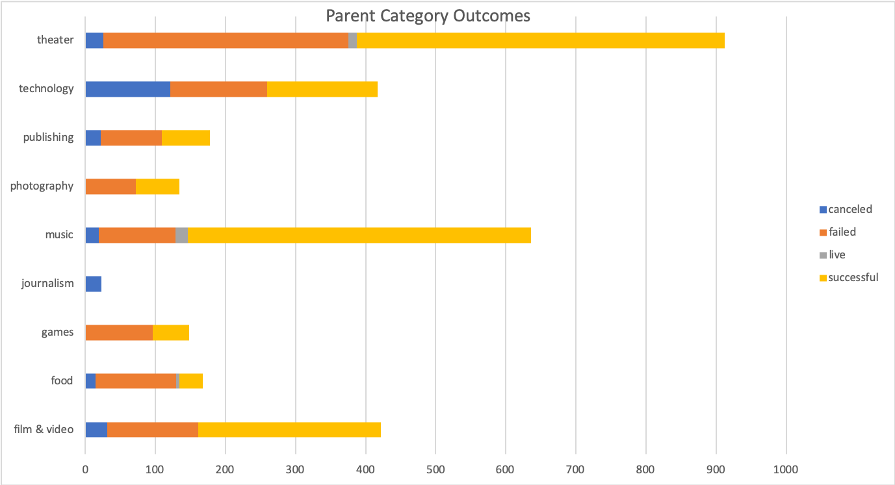
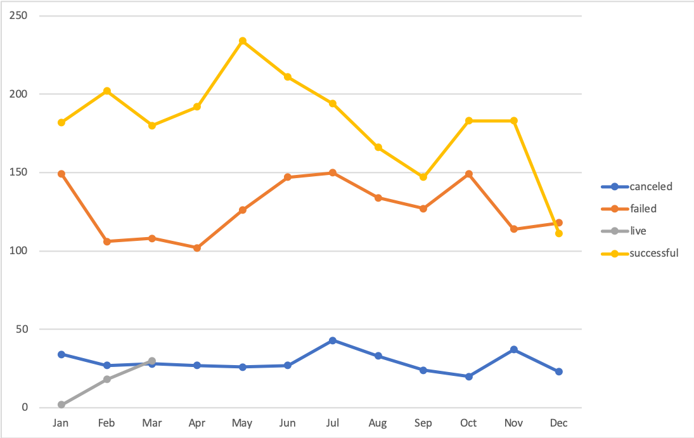
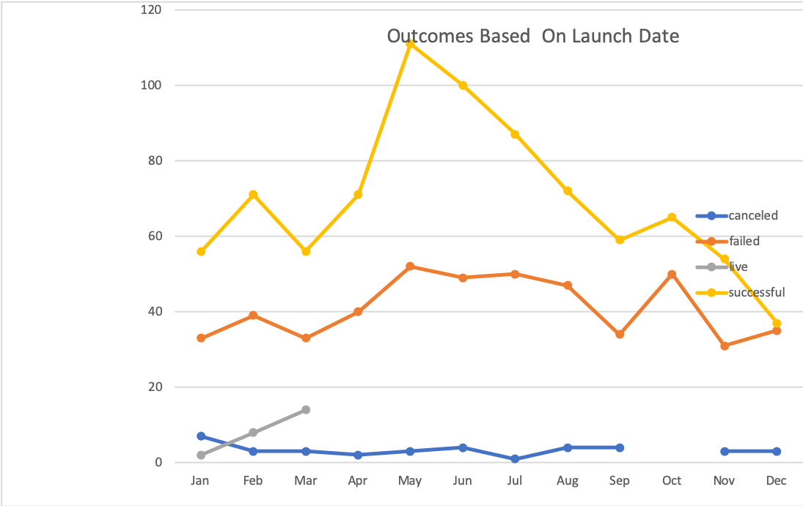
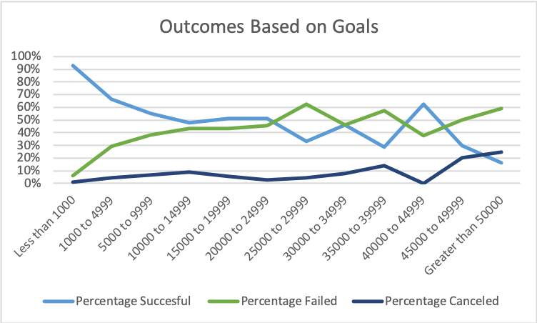

# kickstarter-analysis
Performing Analysis On Kickstarter Data to uncover trends

## Kickstarter pivot chart
This chart shows over all campagign success and failure rates for all funding catagories.
The data indicates that Kickstarter is a good platform to raise funding for plays.
Plays are the most sucessful type of campaign on the platform, aproximately 2/3 of campaigns launched through kickstarter to fund plays are sucessful. 

## Longitudinal Launch Data
Based on this data launching your campaign between Febuary and May gives the greatest likelyhood for a sucessful campaign with the best launch month being May. 

The average successful campaign for play funding in the US is $5,048.00 with the exception of a few outliers, most succesful campaigns fall between the $1,000.00 and $5,000.00 funding range. 

and is funded by avg of 63 doners and frequently as few as 41 for the median number of doners.  Average donation for campaigns in her category are 88.78$ and Median Donation of $40.67

She will likely want her campaign length to be between 30 and 60 days, but will have a good idea by 30 days whether it is going to be sucessful. 

She should focus on her marketing swag and video to attract staff picks and maximize size of donation to acrue more $90+ donations. 

## Outcomes Based on Launch Date

## Outcomes Based on Goal

